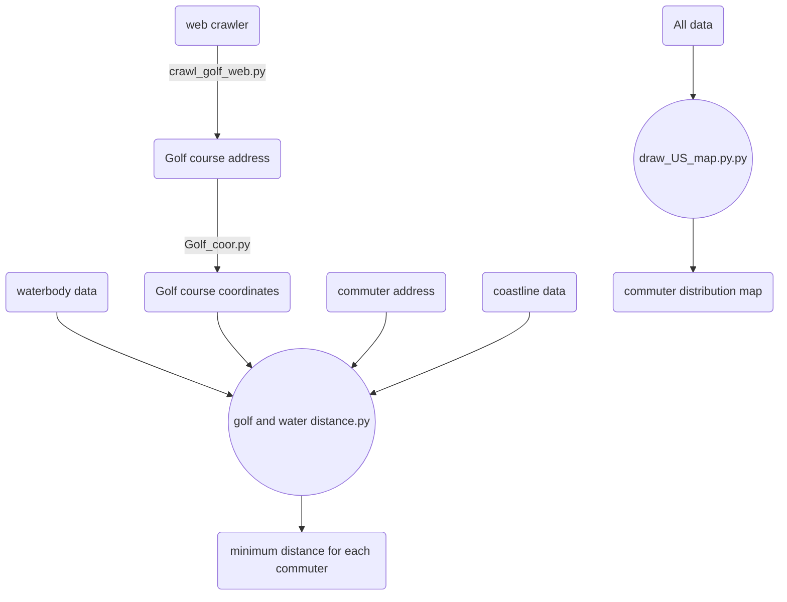

# Goal
1. Get the distance from CEOs living address (and Companies' HQ) to **closest** waterbody, coastline and golf courses
2. Plot a **map** of commuters addresses
# Data source
#### Waterbody and Coastline
After manually checking results of all three below data sources, I found OpenStreetMap is the most accurate one. It contains more detailed information. The final result was calculated using **OpenStreetMap**.

The followings are waterbody and coastline sourses I tested:

* **OpenStreetMap**: <u>https://www.openstreetmap.org</u>
* **Esri**: <u>https://hub.arcgis.com/datasets/esri::usa-detailed-water-bodies/explore?location=32.837100%2C-113.614487%2C4.63&showTable=true</u>
* **USGS** <u>https://www.sciencebase.gov/catalog/item/4fb55df0e4b04cb937751e02</u>
* **US Census Bureau**: <u>https://catalog.data.gov/dataset/tiger-line-shapefile-2019-nation-u-s-coastline-national-shapefile</u>

# Processing flowchart

# Code detail
#### Distance calculation
1. I used **Google geocode API** to get coordinates of all home addresses and headquarter addresses
2. Extracted waterbody polygon data and coastline linearity data from **OpenStreetMap**
3. Converted coordinate system from **WGS84** (lat long coordinates) to **EPSG:3310** (meter coordinates)
4. Impose **cut-off** restriction to filter waterbody larger than certain area (like 1 square mile, 10 square mile)
5.  Iterate commuters' address to calculate distance to every waterbody and get the **minimun distance**

#### Plot map
Use **three different layers** of geodata (coastline, state boarder, waterbody) to plot the **background**. Add annotation for each state. Scatter plot commuters addresses
